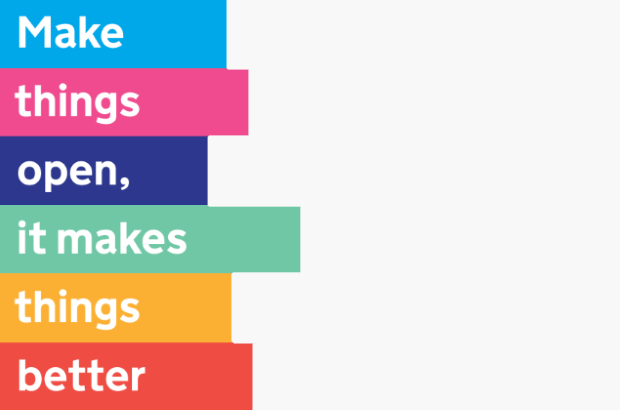

Video calls should be interactive, fun, and more natural than a grid of little squares. They should also be accessible to everyone.

## Case study

**[Zeitgeist](https://zg-app.com)**, developed by Nesta's [Centre for Collective Intelligence](https://www.nesta.org.uk/project/centre-collective-intelligence/), is an application that delivers small-group deliberative workshops both in-person and remotely.

It has interactive elements for polling and group problem solving, shared video playback, and the ability to capture group deliberation audio and transcripts for analysis. For remote workshops, the user interface features a video call, front and centre.

When planning Zeitgeist's remote workshop capabilities a year or so ago, I encountered a frustrating problem:

> There's no easily customisable video call library that offers a layer of absraction between the application and multiple video call providers.

Each video call provider offers their own SDK, and the only approach is to build the application for your chosen provider.

**Once you've done that, though, you're locked in.**

### Why does vendor lock-in matter?

You've found a service that meets your needs, and you've built your first version against their SDK, and you're in production. That's great!

You might not notice vendor lock-in until you need to switch provider. If it requires effort, you could be landed with a signficant piece of work to replace the code that depends on the service.

- What happens if your current video call provider raises their prices?
- What happens if they fall behind on accessibility, security patches, or features?

Managing lock-in is managing risk.

### What do video calling applications need?

If we are to solve this problem for video calls, we need a clear understanding of the features available from each vendor we intend to support, so they can be mapped to each other, and to a layer of abstraction that sits between them.

Zeitgeist had some pretty common needs for a video call application:

- a simple API to create and manage video calls
- device compatibility checks
- easily styled components
- easily customisable components and layouts (we mix an interactive workshop tile with regular video stream tiles)
- common video call features:
  - name labels, and roster
  - audio and video device controls
  - current speaker tracking
  - breakout rooms
  - transcription support
  - mute and ban
  - microphone volume monitor
  - background noise reduction
  - background blur
  - raised hands and emoji reactions

There's more we'd have loved to do - and expectations for video calls could go further, with:

- chat functions and UI components
- captions and translated captions

Our best option was the [Amazon Chime SDK for Javascript](https://github.com/aws/amazon-chime-sdk-js) and the [Amazon Chime SDK React Components Library](https://github.com/aws/amazon-chime-sdk-component-library-react) - which met most of these needs.

We were able to use many of the features available through the SDK, and the rest we were able to build, giving some controls (like muting and banning) to the application to handle.

### Where's the risk?

Amazon [Chime](https://docs.aws.amazon.com/chime/latest/ag/amazon-chime-transition-features.html) reached end of life in February 2026. This has not impacted the availability of the [Chime SDK](https://aws.amazon.com/chime/chime-sdk/) yet - although it seems no new features are planned for it.

Much like other services, video call providers come and go. Being able to easily switch away from the Chime SDK would make it much easier for a customer to start using it. It would certainly have made it easier for us!

That's one of the issues **crossvid** is intended to solve.

## What are the project goals?

There are several key goals:

1. Make it easy to switch video call provider by changing configuration
2. Make it easy to build custom components and layouts for video call interfaces
3. Make it easy to deliver highly accessible experiences for all users

## Planning the project

"Make it easy" is easy to say, but building a video call library that can work with any provider isn't trivial. Each provider has its own terms for common concepts and features, and each offers a unique interface to interact with their service.

### Figuring out the interface

As a developer who worked on a complex video calling application, I've a good understanding of the common needs.

The first step to building something simple and clean is to discard my previous assumptions, and build a mapping between existing terminology, concepts and features across common providers, and develop an abstract feature set to unify these.

That's what I'll be doing first.

### Working in the open

crossvid is an open source project, and will be licensed under the MIT license. Everything I do - from this website and blog, to the backend services I build and the frontend UI components will be open source.

Feel free to follow along with this dev blog, or take a closer look at the [crossvid development board](https://github.com/orgs/crossvid/projects/1) (barely begun!)

**Why work in the open?** Some of it's about accountability. In a world of vibe-coded apps where everyone can build a tool to scratch an itch, quality and continuity matters.

I'm building **crossvid** to be a well-maintained resource. That means:
- easily maintained libraries
- well documented interfaces
- common conventions and frameworks
- automated testing with high coverage

It should be easy to use, easy to fork, and easy to maintain - and those are values that will help guide the choices I make.

## Make contact

If you're a developer, working on or planning an application that uses video call features, I'd love to hear from you. Do please [reach out](/contact).